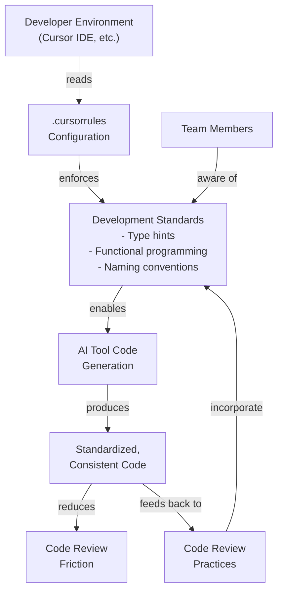
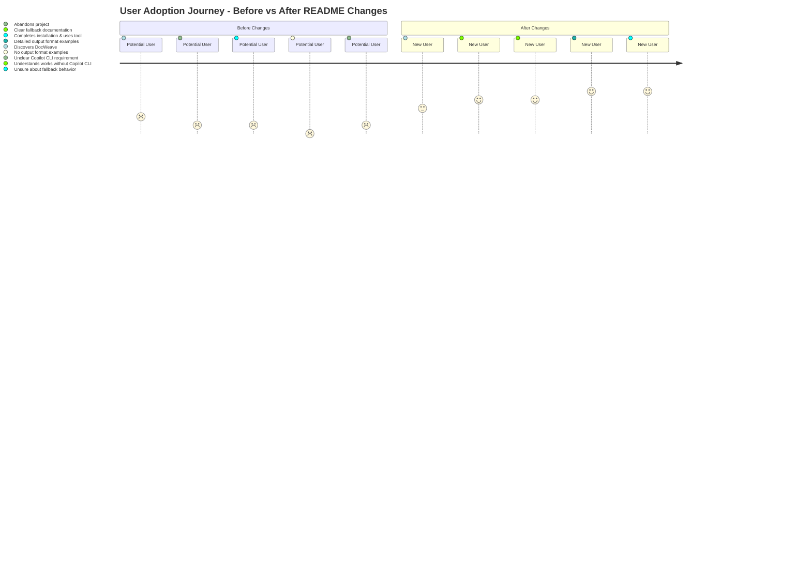
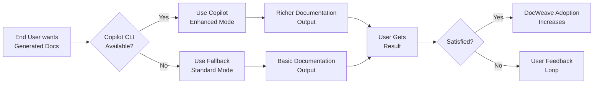
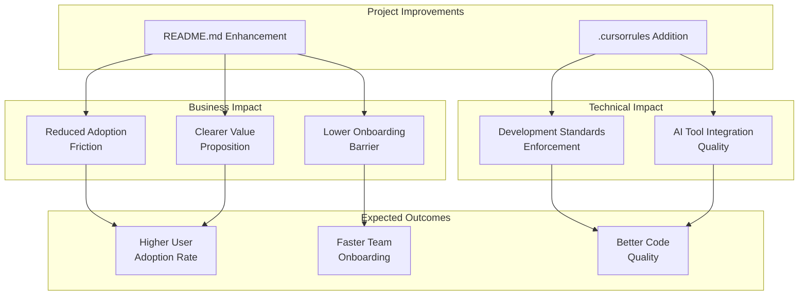
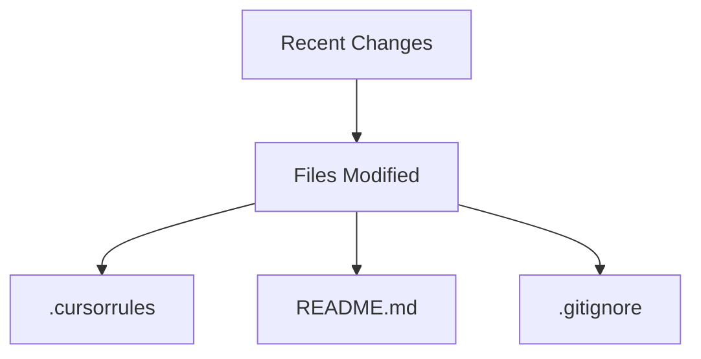
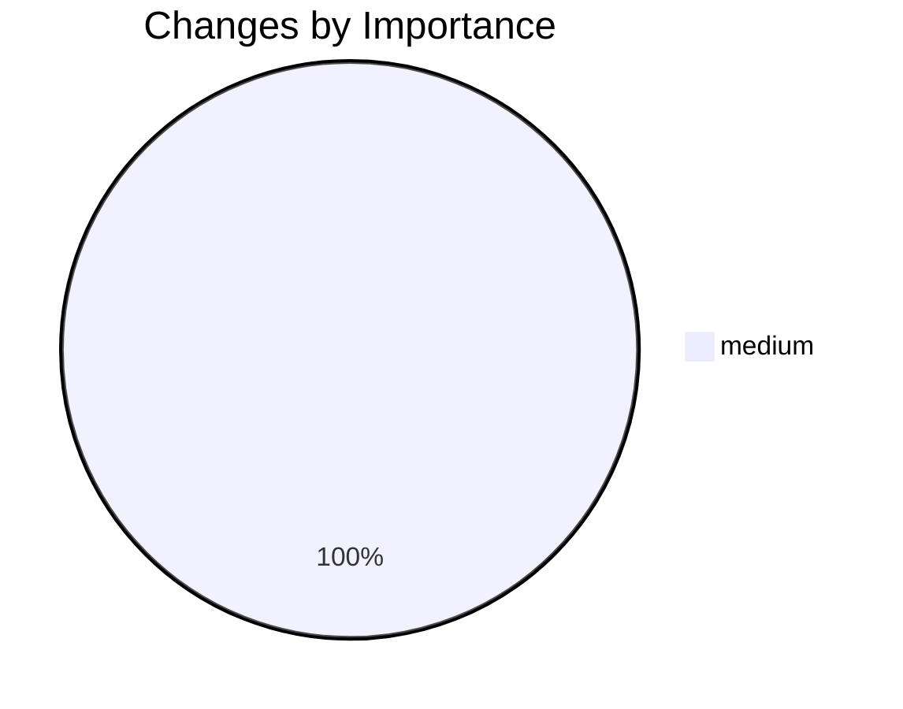

# Diagrams

```mermaid
graph TD
    A["Developer Environment<br/>(Cursor IDE, etc.)"] -->|reads| B[".cursorrules<br/>Configuration"]
    B -->|enforces| C["Development Standards<br/>- Type hints<br/>- Functional programming<br/>- Naming conventions"]
    C -->|enables| D["AI Tool Code<br/>Generation"]
    D -->|produces| E["Standardized,<br/>Consistent Code"]
    E -->|reduces| F["Code Review<br/>Friction"]
    
    G["Team Members"] -->|aware of| C
    H["Code Review<br/>Practices"] -->|incorporate| C
    E -->|feeds back to| H
```

```mermaid
journey
    title User Adoption Journey - Before vs After README Changes
    section Before Changes
      Potential User: 2: Discovers DocWeave
      Potential User: 1: Unclear Copilot CLI requirement
      Potential User: 1: Unsure about fallback behavior
      Potential User: 0: No output format examples
      Potential User: 1: Abandons project
    section After Changes
      New User: 3: Discovers DocWeave
      New User: 4: Understands works without Copilot CLI
      New User: 4: Clear fallback documentation
      New User: 5: Detailed output format examples
      New User: 5: Completes installation & uses tool
```

```mermaid
graph LR
    A["End User wants<br/>Generated Docs"] --> B{Copilot CLI<br/>Available?}
    B -->|Yes| C["Use Copilot<br/>Enhanced Mode"]
    C --> D["Richer Documentation<br/>Output"]
    B -->|No| E["Use Fallback<br/>Standard Mode"]
    E --> F["Basic Documentation<br/>Output"]
    D --> G["User Gets<br/>Result"]
    F --> G
    G --> H{Satisfied?}
    H -->|Yes| I["DocWeave Adoption<br/>Increases"]
    H -->|No| J["User Feedback<br/>Loop"]
```

```mermaid
graph TB
    subgraph "Project Improvements"
        A["README.md Enhancement"]
        B[".cursorrules Addition"]
    end
    
    subgraph "Technical Impact"
        C["Development Standards<br/>Enforcement"]
        D["AI Tool Integration<br/>Quality"]
    end
    
    subgraph "Business Impact"
        E["Reduced Adoption<br/>Friction"]
        F["Clearer Value<br/>Proposition"]
        G["Lower Onboarding<br/>Barrier"]
    end
    
    subgraph "Expected Outcomes"
        H["Higher User<br/>Adoption Rate"]
        I["Better Code<br/>Quality"]
        J["Faster Team<br/>Onboarding"]
    end
    
    A --> E
    A --> F
    A --> G
    B --> C
    B --> D
    C --> I
    D --> I
    E --> H
    F --> H
    G --> J
```

```mermaid
gantt
    title Recent Commits Timeline
    dateFormat YYYY-MM-DD
    fadc4ed :2026-02-15, 1d
```

```mermaid
graph TD
    A[Recent Changes] --> B[Files Modified]
    B --> F1[".cursorrules"]
    B --> F2["README.md"]
    B --> F3[".gitignore"]
```

```mermaid
pie title Changes by Importance
    "medium" : 1
```