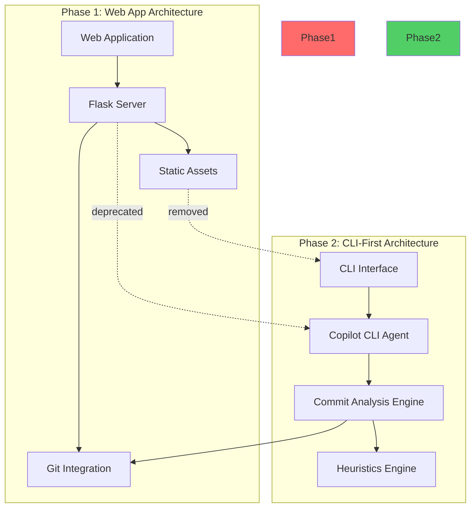
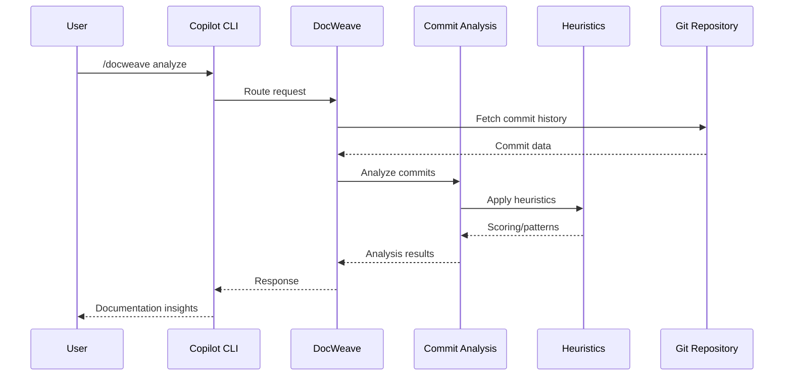
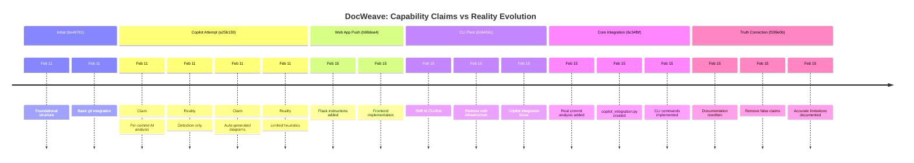
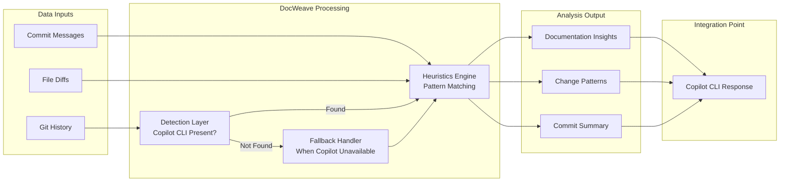
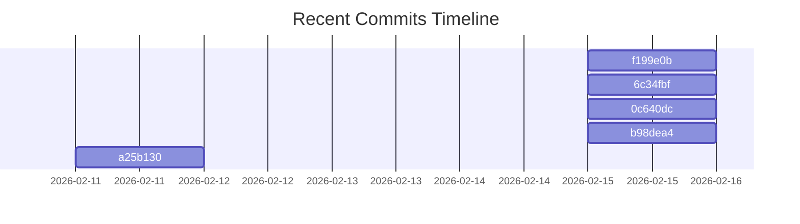
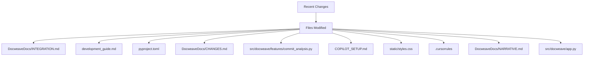
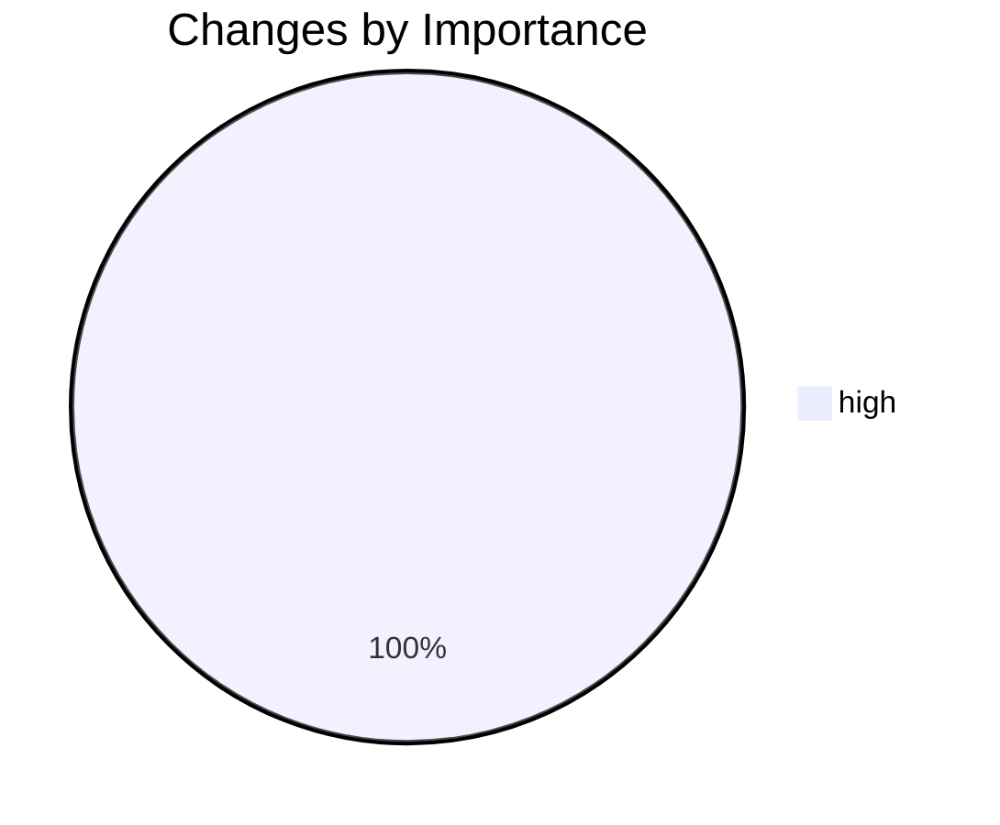

# Diagrams

```mermaid
graph TB
    subgraph "Phase 1: Web App Architecture"
        WEB["Web Application"]
        FLASK["Flask Server"]
        STATIC["Static Assets"]
        GIT["Git Integration"]
        WEB --> FLASK
        FLASK --> STATIC
        FLASK --> GIT
    end
    
    subgraph "Phase 2: CLI-First Architecture"
        CLI["CLI Interface"]
        COPILOT["Copilot CLI Agent"]
        ANALYSIS["Commit Analysis Engine"]
        HEURISTICS["Heuristics Engine"]
        CLI --> COPILOT
        COPILOT --> ANALYSIS
        ANALYSIS --> HEURISTICS
        ANALYSIS --> GIT
    end
    
    FLASK -.->|deprecated| COPILOT
    STATIC -.->|removed| CLI
    
    style Phase1 fill:#ff6b6b
    style Phase2 fill:#51cf66
```

```mermaid
sequenceDiagram
    participant User
    participant CopilotCLI as Copilot CLI
    participant DocWeave
    participant CommitAnalysis as Commit Analysis
    participant Heuristics
    participant GitRepo as Git Repository
    
    User->>CopilotCLI: /docweave analyze
    CopilotCLI->>DocWeave: Route request
    DocWeave->>GitRepo: Fetch commit history
    GitRepo-->>DocWeave: Commit data
    DocWeave->>CommitAnalysis: Analyze commits
    CommitAnalysis->>Heuristics: Apply heuristics
    Heuristics-->>CommitAnalysis: Scoring/patterns
    CommitAnalysis-->>DocWeave: Analysis results
    DocWeave-->>CopilotCLI: Response
    CopilotCLI-->>User: Documentation insights
```

```mermaid
timeline
    title DocWeave: Capability Claims vs Reality Evolution
    
    section Initial (be49781)
        Feb 11: Foundational structure
        Feb 11: Basic git integration
    
    section Copilot Attempt (a25b130)
        Feb 11: Claim: Per-commit AI analysis
        Feb 11: Reality: Detection only
        Feb 11: Claim: Auto-generated diagrams
        Feb 11: Reality: Limited heuristics
    
    section Web App Push (b98dea4)
        Feb 15: Flask instructions added
        Feb 15: Frontend implementation
    
    section CLI Pivot (0c640dc)
        Feb 15: Shift to CLI-first
        Feb 15: Remove web infrastructure
        Feb 15: Copilot integration focus
    
    section Core Integration (6c34fbf)
        Feb 15: Real commit analysis added
        Feb 15: copilot_integration.py created
        Feb 15: CLI commands implemented
    
    section Truth Correction (f199e0b)
        Feb 15: Documentation rewritten
        Feb 15: Remove false claims
        Feb 15: Accurate limitations documented
```

```mermaid
graph LR
    subgraph "Data Inputs"
        GITHISTORY["Git History"]
        MESSAGES["Commit Messages"]
        DIFF["File Diffs"]
    end
    
    subgraph "DocWeave Processing"
        DETECTION["Detection Layer<br/>Copilot CLI Present?"]
        HEURISTICS_ENGINE["Heuristics Engine<br/>Pattern Matching"]
        FALLBACK["Fallback Handler<br/>When Copilot Unavailable"]
    end
    
    subgraph "Analysis Output"
        INSIGHTS["Documentation Insights"]
        PATTERNS["Change Patterns"]
        SUMMARY["Commit Summary"]
    end
    
    subgraph "Integration Point"
        COPILOT_RESPONSE["Copilot CLI Response"]
    end
    
    GITHISTORY --> DETECTION
    MESSAGES --> HEURISTICS_ENGINE
    DIFF --> HEURISTICS_ENGINE
    DETECTION -->|Found| HEURISTICS_ENGINE
    DETECTION -->|Not Found| FALLBACK
    FALLBACK --> HEURISTICS_ENGINE
    HEURISTICS_ENGINE --> INSIGHTS
    HEURISTICS_ENGINE --> PATTERNS
    HEURISTICS_ENGINE --> SUMMARY
    INSIGHTS --> COPILOT_RESPONSE
    PATTERNS --> COPILOT_RESPONSE
    SUMMARY --> COPILOT_RESPONSE
```

```mermaid
gantt
    title Recent Commits Timeline
    dateFormat YYYY-MM-DD
    f199e0b :2026-02-15, 1d
    6c34fbf :2026-02-15, 1d
    0c640dc :2026-02-15, 1d
    b98dea4 :2026-02-15, 1d
    a25b130 :2026-02-11, 1d
```

```mermaid
graph TD
    A[Recent Changes] --> B[Files Modified]
    B --> F1["DocweaveDocs/INTEGRATION.md"]
    B --> F2["development_guide.md"]
    B --> F3["pyproject.toml"]
    B --> F4["DocweaveDocs/CHANGES.md"]
    B --> F5["src/docweave/features/commit_analysis.py"]
    B --> F6["COPILOT_SETUP.md"]
    B --> F7["static/styles.css"]
    B --> F8[".cursorrules"]
    B --> F9["DocweaveDocs/NARRATIVE.md"]
    B --> F10["src/docweave/app.py"]
```

```mermaid
pie title Changes by Importance
    "high" : 6
```