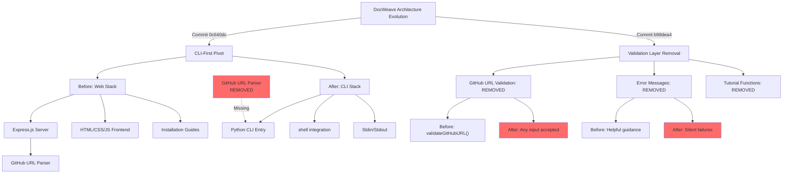
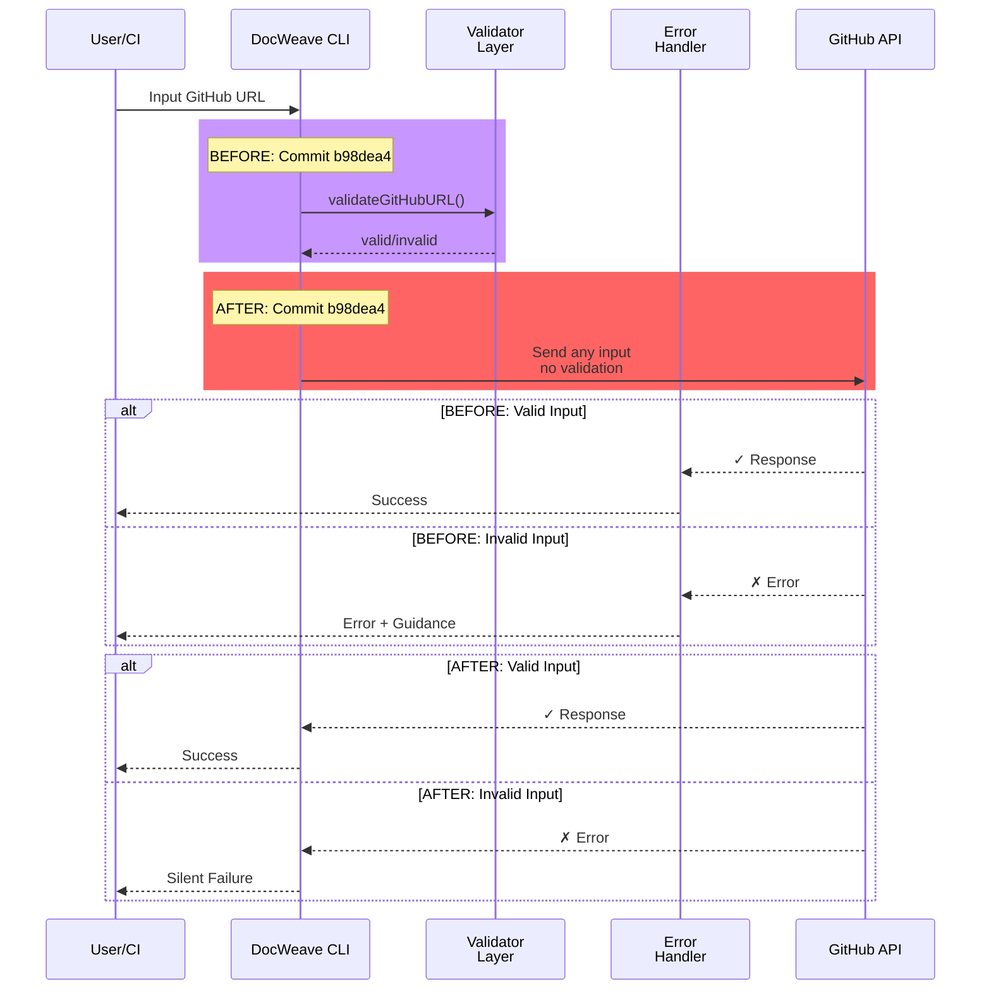
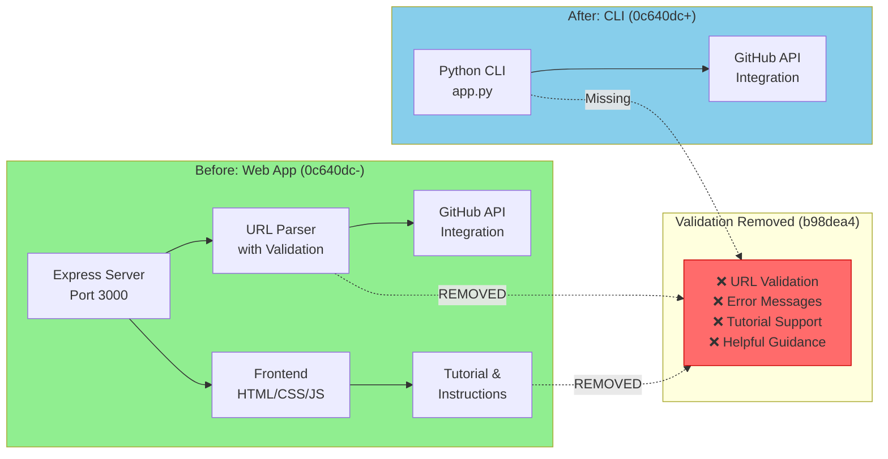
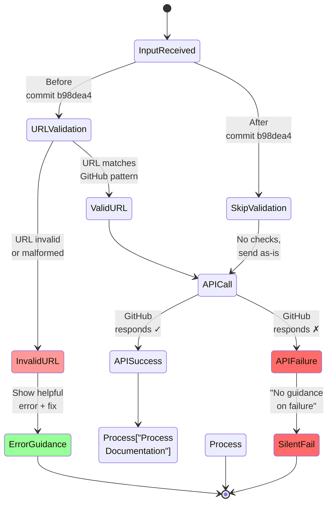
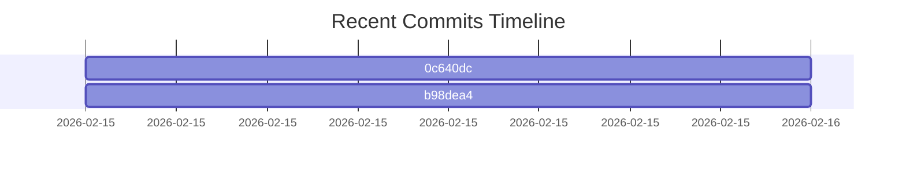
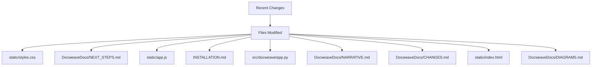
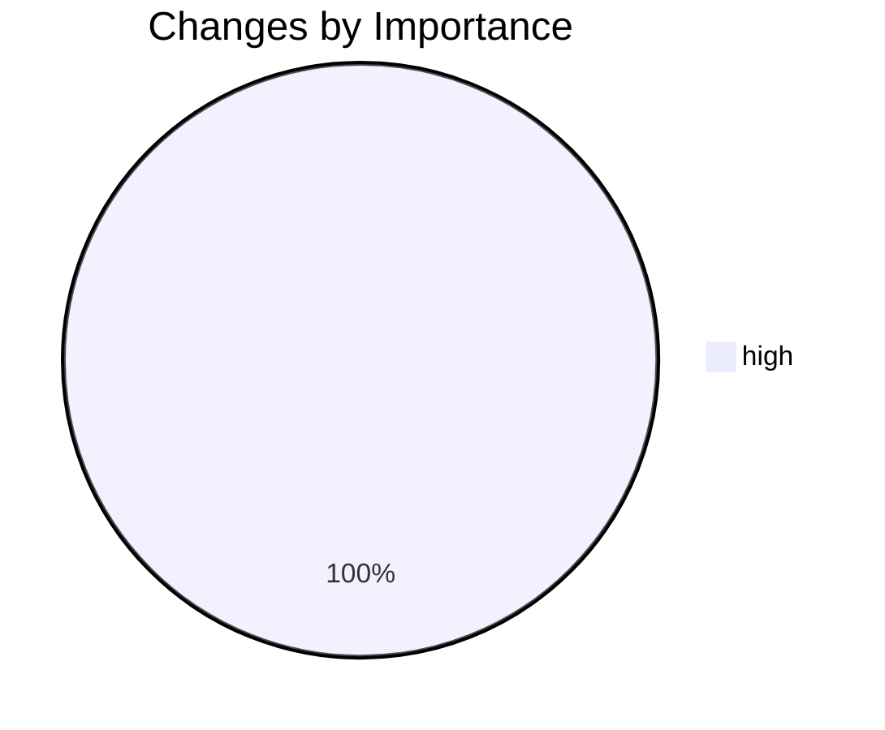

# Diagrams

```mermaid
graph TD
    A["DocWeave Architecture Evolution"] -->|Commit 0c640dc| B["CLI-First Pivot"]
    A -->|Commit b98dea4| C["Validation Layer Removal"]
    
    B --> B1["Before: Web Stack"]
    B --> B2["After: CLI Stack"]
    
    B1 --> B1a["Express.js Server"]
    B1 --> B1b["HTML/CSS/JS Frontend"]
    B1 --> B1c["Installation Guides"]
    B1a --> B1d["GitHub URL Parser"]
    
    B2 --> B2a["Python CLI Entry"]
    B2 --> B2b["shell integration"]
    B2 --> B2c["Stdin/Stdout"]
    B2d["GitHub URL Parser<br/>REMOVED"] -.->|Missing| B2a
    
    C --> C1["GitHub URL Validation: REMOVED"]
    C --> C2["Error Messages: REMOVED"]
    C --> C3["Tutorial Functions: REMOVED"]
    
    C1 --> C1a["Before: validateGitHubURL()"]
    C1 --> C1b["After: Any input accepted"]
    
    C2 --> C2a["Before: Helpful guidance"]
    C2 --> C2b["After: Silent failures"]
    
    style B2d fill:#ff6b6b
    style C1b fill:#ff6b6b
    style C2b fill:#ff6b6b
```

```mermaid
sequenceDiagram
    participant User as User/CI
    participant CLI as DocWeave CLI
    participant Validator as Validator<br/>Layer
    participant ErrorHandler as Error<br/>Handler
    participant GitHub as GitHub API
    
    User->>CLI: Input GitHub URL
    
    rect rgb(200, 150, 255)
    Note over CLI: BEFORE: Commit b98dea4
    CLI->>Validator: validateGitHubURL()
    Validator-->>CLI: valid/invalid
    end
    
    rect rgb(255, 100, 100)
    Note over CLI: AFTER: Commit b98dea4
    CLI->>GitHub: Send any input<br/>no validation
    end
    
    alt BEFORE: Valid Input
        GitHub-->>ErrorHandler: ✓ Response
        ErrorHandler-->>User: Success
    else BEFORE: Invalid Input
        GitHub-->>ErrorHandler: ✗ Error
        ErrorHandler-->>User: Error + Guidance
    end
    
    alt AFTER: Valid Input
        GitHub-->>CLI: ✓ Response
        CLI-->>User: Success
    else AFTER: Invalid Input
        GitHub-->>CLI: ✗ Error
        CLI-->>User: Silent Failure
    end
```

```mermaid
graph LR
    subgraph Before["Before: Web App (0c640dc-)"]
        WEB["Express Server<br/>Port 3000"] --> PARSE["URL Parser<br/>with Validation"]
        PARSE --> API["GitHub API<br/>Integration"]
        WEB --> FE["Frontend<br/>HTML/CSS/JS"]
        FE --> GUIDE["Tutorial &<br/>Instructions"]
    end
    
    subgraph After["After: CLI (0c640dc+)"]
        CLI["Python CLI<br/>app.py"] --> GITHUBAPI["GitHub API<br/>Integration"]
    end
    
    subgraph Degradation["Validation Removed (b98dea4)"]
        MISSING["❌ URL Validation<br/>❌ Error Messages<br/>❌ Tutorial Support<br/>❌ Helpful Guidance"]
    end
    
    PARSE -.->|REMOVED| MISSING
    GUIDE -.->|REMOVED| MISSING
    CLI -.->|Missing| MISSING
    
    style MISSING fill:#ff6b6b,stroke:#cc0000
    style Before fill:#90EE90
    style After fill:#87CEEB
```

```mermaid
stateDiagram-v2
    [*] --> InputReceived
    
    InputReceived --> URLValidation: Before<br/>commit b98dea4
    InputReceived --> SkipValidation: After<br/>commit b98dea4
    
    URLValidation --> ValidURL: URL matches<br/>GitHub pattern
    URLValidation --> InvalidURL: URL invalid<br/>or malformed
    
    InvalidURL --> ErrorGuidance: Show helpful<br/>error + fix
    ErrorGuidance --> [*]
    
    ValidURL --> APICall
    SkipValidation --> APICall: No checks,<br/>send as-is
    
    APICall --> APISuccess: GitHub<br/>responds ✓
    APICall --> APIFailure: GitHub<br/>responds ✗
    
    APISuccess --> Process["Process<br/>Documentation"]
    Process --> [*]
    
    APIFailure --> SilentFail: "No guidance<br/>on failure"
    SilentFail --> [*]
    
    style InvalidURL fill:#ff9999
    style ErrorGuidance fill:#99ff99
    style SilentFail fill:#ff6b6b
    style APIFailure fill:#ff6b6b
```

```mermaid
gantt
    title Recent Commits Timeline
    dateFormat YYYY-MM-DD
    0c640dc :2026-02-15, 1d
    b98dea4 :2026-02-15, 1d
```

```mermaid
graph TD
    A[Recent Changes] --> B[Files Modified]
    B --> F1["static/styles.css"]
    B --> F2["DocweaveDocs/NEXT_STEPS.md"]
    B --> F3["static/app.js"]
    B --> F4["INSTALLATION.md"]
    B --> F5["src/docweave/app.py"]
    B --> F6["DocweaveDocs/NARRATIVE.md"]
    B --> F7["DocweaveDocs/CHANGES.md"]
    B --> F8["static/index.html"]
    B --> F9["DocweaveDocs/DIAGRAMS.md"]
```

```mermaid
pie title Changes by Importance
    "high" : 2
```