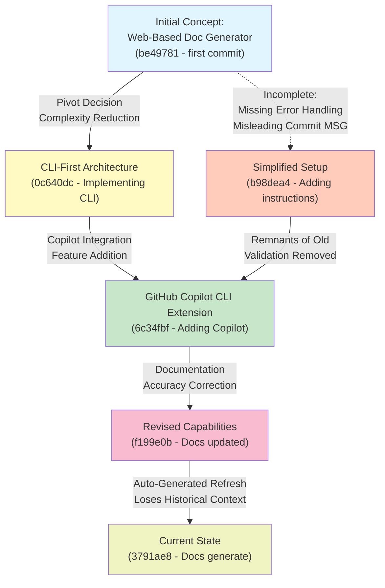
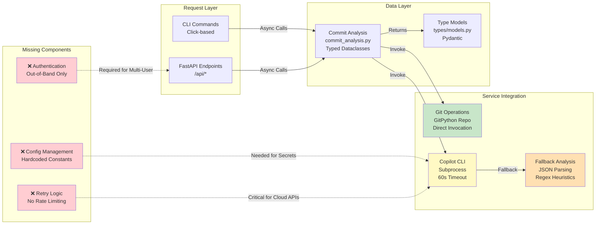
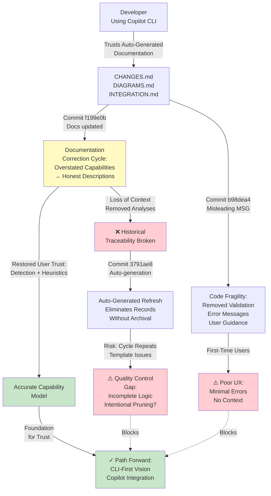
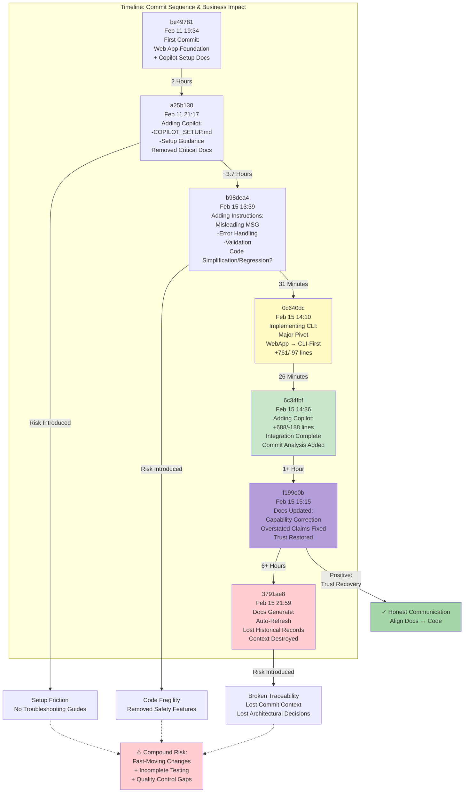
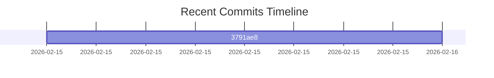
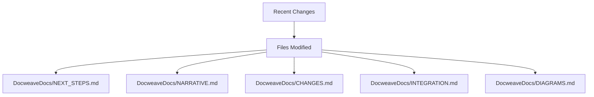
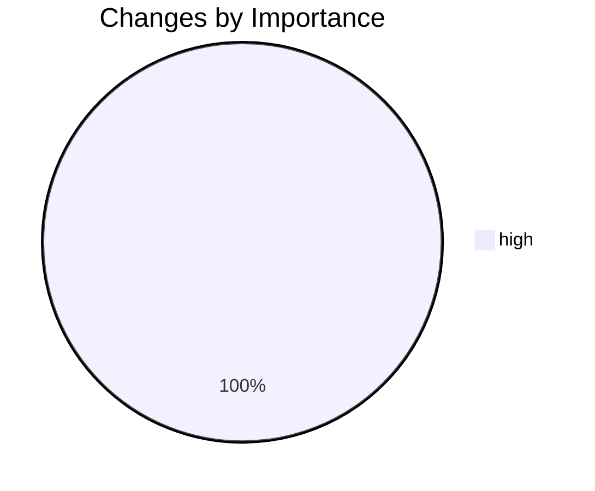

# Diagrams

```mermaid
graph TD
    A["Initial Concept:<br/>Web-Based Doc Generator<br/>(be49781 - first commit)"] -->|Pivot Decision<br/>Complexity Reduction| B["CLI-First Architecture<br/>(0c640dc - Implementing CLI)"]
    
    B -->|Copilot Integration<br/>Feature Addition| C["GitHub Copilot CLI Extension<br/>(6c34fbf - Adding Copilot)"]
    
    C -->|Documentation<br/>Accuracy Correction| D["Revised Capabilities<br/>(f199e0b - Docs updated)"]
    
    A -.->|Incomplete:<br/>Missing Error Handling<br/>Misleading Commit MSG| E["Simplified Setup<br/>(b98dea4 - Adding instructions)"]
    
    E -->|Remnants of Old<br/>Validation Removed| C
    
    D -->|Auto-Generated Refresh<br/>Loses Historical Context| F["Current State<br/>(3791ae8 - Docs generate)"]
    
    style A fill:#e1f5ff
    style B fill:#fff9c4
    style C fill:#c8e6c9
    style D fill:#f8bbd0
    style E fill:#ffccbc
    style F fill:#f0f4c3
```

```mermaid
graph LR
    subgraph "Request Layer"
        CLI["CLI Commands<br/>Click-based"]
        API["FastAPI Endpoints<br/>/api/*"]
    end
    
    subgraph "Service Integration"
        GIT["Git Operations<br/>GitPython Repo<br/>Direct Invocation"]
        COPILOT["Copilot CLI<br/>Subprocess<br/>60s Timeout"]
        HEURISTICS["Fallback Analysis<br/>JSON Parsing<br/>Regex Heuristics"]
    end
    
    subgraph "Data Layer"
        ANALYSIS["Commit Analysis<br/>commit_analysis.py<br/>Typed Dataclasses"]
        MODELS["Type Models<br/>types/models.py<br/>Pydantic"]
    end
    
    subgraph "Missing Components"
        AUTH["❌ Authentication<br/>Out-of-Band Only"]
        CONFIG["❌ Config Management<br/>Hardcoded Constants"]
        RETRY["❌ Retry Logic<br/>No Rate Limiting"]
    end
    
    CLI -->|Async Calls| ANALYSIS
    API -->|Async Calls| ANALYSIS
    
    ANALYSIS -->|Invoke| GIT
    ANALYSIS -->|Invoke| COPILOT
    COPILOT -->|Fallback| HEURISTICS
    
    ANALYSIS -->|Returns| MODELS
    
    AUTH -.->|Required for Multi-User| API
    CONFIG -.->|Needed for Secrets| COPILOT
    RETRY -.->|Critical for Cloud APIs| COPILOT
    
    style GIT fill:#c8e6c9
    style COPILOT fill:#fff9c4
    style HEURISTICS fill:#ffe0b2
    style AUTH fill:#ffcdd2
    style CONFIG fill:#ffcdd2
    style RETRY fill:#ffcdd2
```

```mermaid
graph TD
    USERS["Developer<br/>Using Copilot CLI"] -->|Trusts Auto-Generated<br/>Documentation| DOCS["CHANGES.md<br/>DIAGRAMS.md<br/>INTEGRATION.md"]
    
    DOCS -->|Commit f199e0b<br/>Docs updated| CORRECTION["Documentation<br/>Correction Cycle:<br/>Overstated Capabilities<br/>→ Honest Descriptions"]
    
    CORRECTION -->|Restored User Trust:<br/>Detection + Heuristics| ACCURATE["Accurate Capability<br/>Model"]
    
    CORRECTION -->|Loss of Context<br/>Removed Analyses| CONTEXT["❌ Historical<br/>Traceability Broken"]
    
    CONTEXT -->|Commit 3791ae8<br/>Auto-generation| REGEN["Auto-Generated Refresh<br/>Eliminates Records<br/>Without Archival"]
    
    REGEN -->|Risk: Cycle Repeats<br/>Template Issues| QUALITY["⚠️ Quality Control<br/>Gap:<br/>Incomplete Logic<br/>Intentional Pruning?"]
    
    DOCS -->|Commit b98dea4<br/>Misleading MSG| FRAGILITY["Code Fragility:<br/>Removed Validation<br/>Error Messages<br/>User Guidance"]
    
    FRAGILITY -->|First-Time Users| UX["⚠️ Poor UX:<br/>Minimal Errors<br/>No Context"]
    
    ACCURATE -->|Foundation<br/>for Trust| SUCCESS["✓ Path Forward:<br/>CLI-First Vision<br/>Copilot Integration"]
    
    QUALITY -.->|Blocks| SUCCESS
    UX -.->|Blocks| SUCCESS
    
    style ACCURATE fill:#c8e6c9
    style SUCCESS fill:#c8e6c9
    style CONTEXT fill:#ffcdd2
    style QUALITY fill:#ffcdd2
    style UX fill:#ffcdd2
    style CORRECTION fill:#fff9c4
```

```mermaid
graph TB
    subgraph "Timeline: Commit Sequence & Business Impact"
        T1["be49781<br/>Feb 11 19:34<br/>First Commit:<br/>Web App Foundation<br/>+ Copilot Setup Docs"]
        
        T2["a25b130<br/>Feb 11 21:17<br/>Adding Copilot:<br/>-COPILOT_SETUP.md<br/>-Setup Guidance<br/>Removed Critical Docs"]
        
        T3["b98dea4<br/>Feb 15 13:39<br/>Adding Instructions:<br/>Misleading MSG<br/>-Error Handling<br/>-Validation<br/>Code Simplification/Regression?"]
        
        T4["0c640dc<br/>Feb 15 14:10<br/>Implementing CLI:<br/>Major Pivot<br/>WebApp → CLI-First<br/>+761/-97 lines"]
        
        T5["6c34fbf<br/>Feb 15 14:36<br/>Adding Copilot:<br/>+688/-188 lines<br/>Integration Complete<br/>Commit Analysis Added"]
        
        T6["f199e0b<br/>Feb 15 15:15<br/>Docs Updated:<br/>Capability Correction<br/>Overstated Claims Fixed<br/>Trust Restored"]
        
        T7["3791ae8<br/>Feb 15 21:59<br/>Docs Generate:<br/>Auto-Refresh<br/>Lost Historical Records<br/>Context Destroyed"]
    end
    
    T1 -->|2 Hours| T2
    T2 -->|~3.7 Hours| T3
    T3 -->|31 Minutes| T4
    T4 -->|26 Minutes| T5
    T5 -->|1+ Hour| T6
    T6 -->|6+ Hours| T7
    
    T2 -->|Risk Introduced| RISK1["Setup Friction<br/>No Troubleshooting Guides"]
    T3 -->|Risk Introduced| RISK2["Code Fragility<br/>Removed Safety Features"]
    T6 -->|Positive:<br/>Trust Recovery| GOOD["✓ Honest Communication<br/>Align Docs ↔ Code"]
    T7 -->|Risk Introduced| RISK3["Broken Traceability<br/>Lost Commit Context<br/>Lost Architectural Decisions"]
    
    RISK1 -.-> COMPOUND["⚠️ Compound Risk:<br/>Fast-Moving Changes<br/>+ Incomplete Testing<br/>+ Quality Control Gaps"]
    RISK2 -.-> COMPOUND
    RISK3 -.-> COMPOUND
    
    style T4 fill:#fff9c4
    style T5 fill:#c8e6c9
    style T6 fill:#b39ddb
    style T7 fill:#ffcdd2
    style GOOD fill:#a5d6a7
    style COMPOUND fill:#ffcdd2
```

```mermaid
gantt
    title Recent Commits Timeline
    dateFormat YYYY-MM-DD
    3791ae8 :2026-02-15, 1d
```

```mermaid
graph TD
    A[Recent Changes] --> B[Files Modified]
    B --> F1["DocweaveDocs/NEXT_STEPS.md"]
    B --> F2["DocweaveDocs/NARRATIVE.md"]
    B --> F3["DocweaveDocs/CHANGES.md"]
    B --> F4["DocweaveDocs/INTEGRATION.md"]
    B --> F5["DocweaveDocs/DIAGRAMS.md"]
```

```mermaid
pie title Changes by Importance
    "high" : 1
```