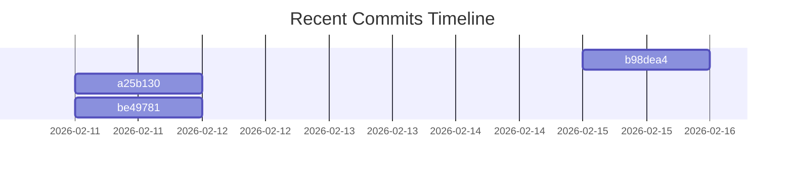
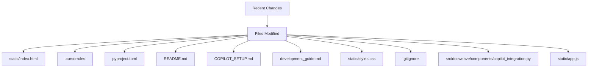
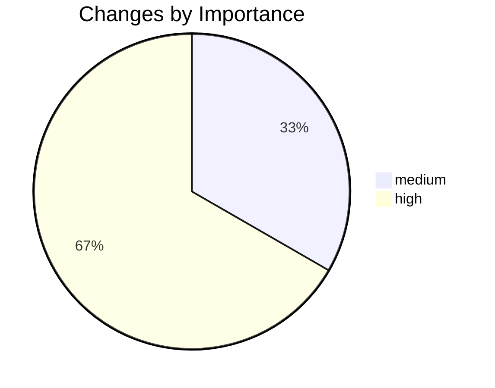

# Diagrams

```mermaid
gantt
    title Recent Commits Timeline
    dateFormat YYYY-MM-DD
    b98dea4 :2026-02-15, 1d
    a25b130 :2026-02-11, 1d
    be49781 :2026-02-11, 1d
```

```mermaid
graph TD
    A[Recent Changes] --> B[Files Modified]
    B --> F1["static/index.html"]
    B --> F2[".cursorrules"]
    B --> F3["pyproject.toml"]
    B --> F4["README.md"]
    B --> F5["COPILOT_SETUP.md"]
    B --> F6["development_guide.md"]
    B --> F7["static/styles.css"]
    B --> F8[".gitignore"]
    B --> F9["src/docweave/components/copilot_integration.py"]
    B --> F10["static/app.js"]
```

```mermaid
pie title Changes by Importance
    "medium" : 1
    "high" : 2
```